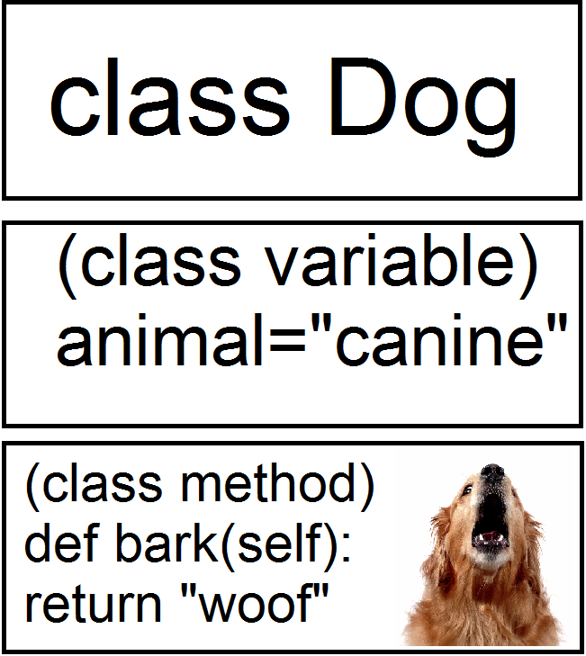

# OOP Four Pillars
## What is OOP

OOP in Python uses classes to define Objects, A class is like a blueprint which can be used to generate as many objects as needed while the class with a defined set of properties is also an object itself. 

We can see here that the Dog class can contain variables and methods which can then be reused by other classes and can also be used to generate more dog objects with the same variables and methods.

## The four pillars

The four pillars are Abstraction, Inheritance, Encapsulation and Polymorphism. Abstraction means details can be hidden, If you look at the diagram you can probably use some of these objects in your day to day life, but you don't know exactly how they work. Inheritance is one class inherting from another, for example a car inheriting wheels while each object is encapsulated, it defines its own state. Finally these classes can be customised, meaning they have Polymorphism.

### Abstraction

This involves the hiding of details from the end user, you should be able to call an object and use it, without fully understanding how it works.This allows the user to use a lot more functions than they otherwise would, if they had to understand every function. It also reduces the complexity of your code and makes it more readable.

### Inheritance

Inheritance lets one object Inherit properties and methods from another, In python this is doe with Child and Parent classes, with the Child class inheriting from the Parent class. When the programmer wants to use a template, only with a few extra details making a new object with inherited methods makes sense. 

### Encapsulation

This is defined as the enclosing of something into a capsule or as if it was in one. This removes things and makes it private , each object controls its own state. Making more things inaccessible if they don't need to be changed.
Encapsulation can be used to seperate long lines of code into modules and reduce the risk of bugs by avoiding overriding variables.

### Polymorphism

Polymorphism means the condition of occurring in several different forms. In Python, that means types in the same inheritance chains being able to do different things. This allows custom overrides in classes whilst avoiding errors.

## The benefits of using OOP

There are many benefits to OOP, firstly your code will be more readable, it will be shorter and more obvious what each block is doing. Secondly It is also more understandable for non coders. Objects work like Objects in real life and will be easier to explain without going into the detail of the code itself. OOP also reduces the risk of errors due to encapsulation and Polymorphism lets the coder generate many similar objects quickly without having to write the entire code for each one.

## What are Lambda functions?

lambda functions are similar to other functions, except they are a one line shortcut that can be stored in a variable.
We write a lambda function like the following code.

`add_two = lamda my_input: my_input + 2`

Here the function is stored in add_two, lambda declares this variable, it is similar to define. my_input is the input we are passing into add_two and finally my_input + 2 is being returned.

## Where Can Lambda functions be useful?

Lambda is best used as an anonymous function inside another function. These are used when a function is needed temporarily for a short period of time.
